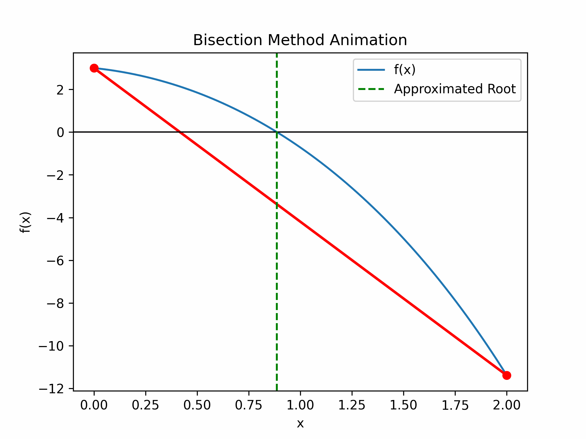
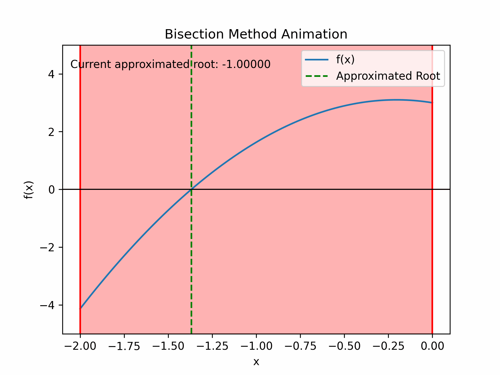

# Numerical Methods Animations

This repository contains Python scripts that demonstrate numerical methods using animations. The provided scripts include implementations for Newton's method and the dichotomy (bisection) method to find the roots of equations.

## Example
\[ f(x) = 4.0 - e^x - 2.0 \cdot x^2 \]

<p float="left">
  
   
</p>


## Requirements

- Python 3.x
- NumPy
- Matplotlib


## Installation

To install the required packages, you can use pip:

```sh
pip install numpy matplotlib


